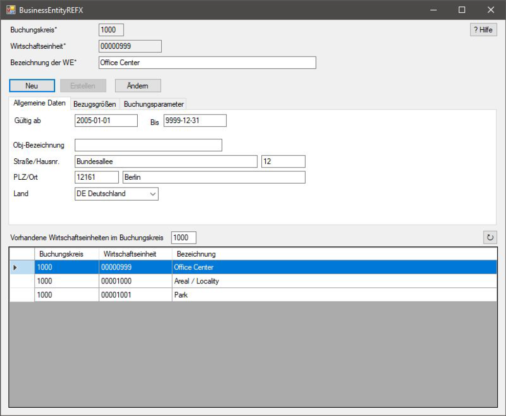

# SAP Webservice Consumer

This application consumes a webservice provided by a SAP system during a project at university.
The webservice itself grants access to the business object "Business Entity REFX".

The methods to create, change and delete a business entity as well as listing all existing ones are implemented in a basic manner (which means not all of the possible attributes are shown or ever filled).

In order for the application to work, you have to be connected to the university's network via proxy and the SAP user used during this project needs to still be active.

